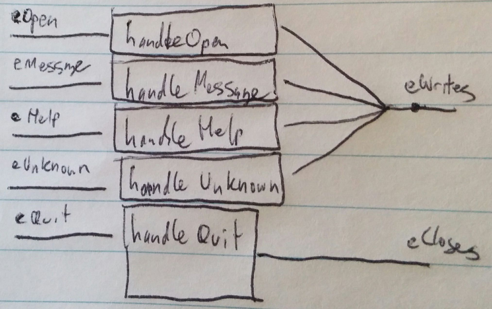
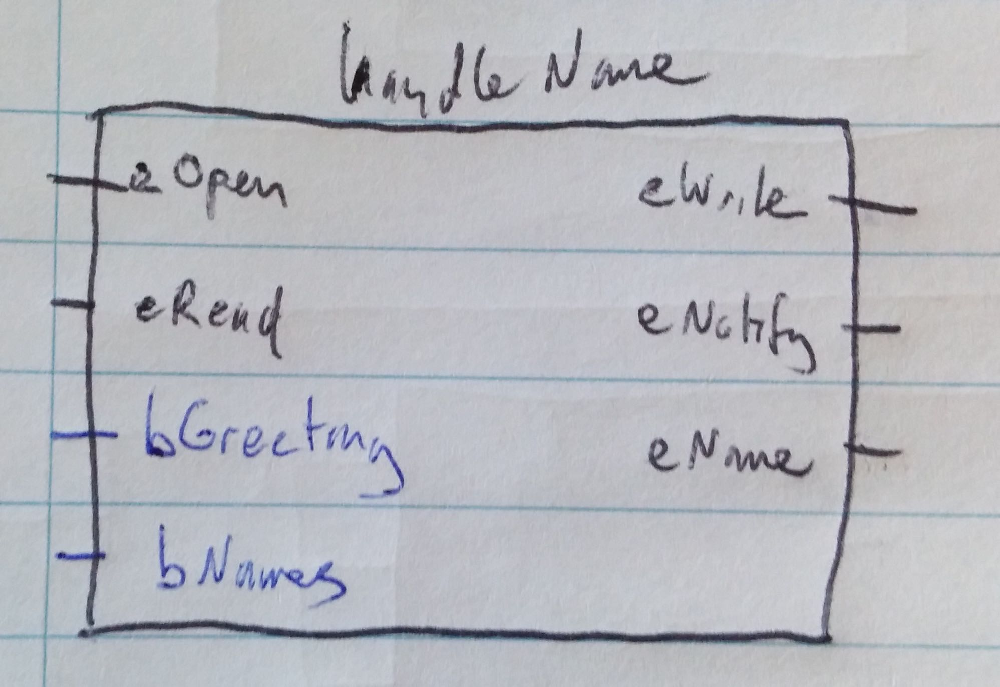

% Functional Reactive Programming with Events and Behaviours - Part 1
% Dave Laing

# Introduction

##

"True" FRP means:

##

- Events and behaviours

## 

- Denotational semantics

## 

- The ability to handle continuous time

##

What does it give us?

##

Composable systems of time-varying state and logic.

##

We are looking at `reactive-banana` today.

##

Part 2 will cover `reflex`.

##

Worth looking at `sodium` if you want this goodness in an other-than-Haskell flavour.

# Events

##

```haskell
data Event a = ...
```

```haskell
instance Functor Event
```

##

Events fire at infinitely-thin logical points in time.

##

```haskell
Event a ~ [(Time,a)]
```

##

Events are push-based.

## 

Each firing of an event is a new logical point in time.

## 

There can be multiple different events active at the same logical point in time.

## 

The `Functor` instance demonstrates this - the output of `fmap` is active at the same points in time as the input.

##

\colsbegin

\column{.5\textwidth}

```haskell
flipper :: Event Colour 
        -> Event Colour
flipper eInput =
  let
    eOutput = 
      flip <$> eInput
  in
    eOutput
```
\column{.5\textwidth}

\

\colsend

##

\colsbegin

\column{.5\textwidth}

```haskell
blue :: Event Colour 
     -> Event Colour
blue eInput =
  let
    eOutput = 
      Blue <$ eInput
  in
    eOutput
```
\column{.5\textwidth}

\

\colsend

##

There are functions to filter and split events.

##

The outputs are active at the same points in time as the inputs - when the outputs are active at all.

##

```haskell
filterE :: (a -> Bool) -> Event a -> Event a
```

\colsbegin

\column{.5\textwidth}

```haskell
red :: Event Colour 
    -> Event Colour
red eInput =
  let
    eOutput = 
      filterE isRed eInput
  in
    eOutput
```
\column{.5\textwidth}

\

\colsend

##

```haskell
split :: Event (Either a b) -> (Event a, Event b)
```

\colsbegin

\column{.5\textwidth}

```haskell
type C = Colour
splitter :: Event (Either C C)
         -> (Event C, Event C)
splitter eInput =
  let
    (eLeft, eRight) = 
      split eInput
  in
    (eLeft, eRight)
```
\column{.5\textwidth}

\

\colsend

##

We need to be aware of the potential for simultaneous events when we combine them.

##

```haskell
unionWith :: (a -> a -> a) 
          -> Event a -> Event a -> Event a
```

\colsbegin

\column{.5\textwidth}

```haskell
mixer :: Event Colour
      -> Event Colour
      -> Event Colour
mixer eInput1 eInput2 =
  let
    eOutput = 
      unionWith 
        mix 
        eInput1 
        eInput2
  in
    eOutput
```
\column{.5\textwidth}

\

\colsend

##

We can build a useful helper from this if you know you're not dealing with simultaneous events or if there is a clear priority between them.

##

```haskell
leftmost :: [Event a] -> Event a
leftmost = foldl (unionWith const) never
```

\colsbegin

\column{.5\textwidth}

```haskell
lister :: [Event Colour]
       -> Event Colour
lister eInput =
  let
    eOutput = 
      leftmost 
        eInput
  in
    eOutput
```
\column{.5\textwidth}

\

\colsend

##

There are other options for composing events:
```haskell
unions :: [Event (a -> a)] -> Event (a -> a)
```
which we'll look at later.

##

Let's do something significant with this.

##

```haskell
multiple :: Int -> Event Int -> Event Int
multiple m = 
  filterE (\x -> x `mod` m == 0)


```

##

```haskell
multiple :: Int -> Event Int -> Event Int
multiple m = 
  filterE (\x -> x `mod` m == 0)

importantWork :: Event Int -> Event String
importantWork eCount =
  let
  
  
  
  in
    ???
```

##

```haskell
multiple :: Int -> Event Int -> Event Int
multiple m = 
  filterE (\x -> x `mod` m == 0)

importantWork :: Event Int -> Event String
importantWork eCount =
  let
    eFizz = "Fizz" <$ multiple 3 eCount
    
    
  in
    ???
```

##

```haskell
multiple :: Int -> Event Int -> Event Int
multiple m = 
  filterE (\x -> x `mod` m == 0)

importantWork :: Event Int -> Event String
importantWork eCount =
  let
    eFizz = "Fizz" <$ multiple 3 eCount
    eBuzz = "Buzz" <$ multiple 5 eCount

  in
    ???
```

##

```haskell
multiple :: Int -> Event Int -> Event Int
multiple m = 
  filterE (\x -> x `mod` m == 0)

importantWork :: Event Int -> Event String
importantWork eCount =
  let
    eFizz = "Fizz" <$ multiple 3 eCount
    eBuzz = "Buzz" <$ multiple 5 eCount
    eFizzBuzz = unionWith (++) eFizz eBuzz
  in
    ???
```

##

```haskell
multiple :: Int -> Event Int -> Event Int
multiple m = 
  filterE (\x -> x `mod` m == 0)

importantWork :: Event Int -> Event String
importantWork eCount =
  let
    eFizz = "Fizz" <$ multiple 3 eCount
    eBuzz = "Buzz" <$ multiple 5 eCount
    eFizzBuzz = unionWith (++) eFizz eBuzz
  in
    eFizzBuzz
```

##

We need a way to build a bridge between the 'inside' and 'outside' of an event network.

##

```haskell
newAddHandler :: IO (AddHandler a, a -> IO ()) 
```

##

```haskell
data EventSource a = EventSource {
    addHandler :: AddHandler a
  , fire       :: a -> IO ()
  }
```

```haskell
mkEventSource :: IO (EventSource a)
mkEventSource =
  uncurry EventSource <$> newAddHandler
```

##

How do we get _new_ logical points in time?

##

They come from outside the event network.

##

There are as many observable logical points in time as there are calls to the various `fire` functions.

##

How do we know we're dealing with something that effects something other than the current logical point in time?

##

You'll see a `Moment` or `MomentIO` context in the type signature.

##

`Moment`/`MomentIO` is a builder monad for the event network.

##

These 'moments' are referred to as 'transactions' in the `sodium` literature.

##

From inside the event network, we can register an event handler:
```haskell
fromAddHandler :: AddHandler a -> MomentIO (Event a) 
```

##

From inside the event network, we can do some `IO` when an event occurs:
```haskell
reactimate :: Event (IO ()) -> MomentIO () 
```

##

Now we can put together an event network.

##

```haskell
networkDescription :: EventSource Int -> MomentIO ()
networkDescription c = do


  let
    eFizz = "Fizz" <$ multiple 3 eCount
    eBuzz = "Buzz" <$ multiple 5 eCount
    eWrite = unionWith (++) eFizz eBuzz
    showCount x =
      putStrLn $ "count: " ++ show x


    
```

##

```haskell
networkDescription :: EventSource Int -> MomentIO ()
networkDescription c = do
  eCount <- fromAddHandler . addHandler $ c

  let
    eFizz = "Fizz" <$ multiple 3 eCount
    eBuzz = "Buzz" <$ multiple 5 eCount
    eWrite = unionWith (++) eFizz eBuzz
    showCount x =
      putStrLn $ "count: " ++ show x


    
```

##

```haskell
networkDescription :: EventSource Int -> MomentIO ()
networkDescription c = do
  eCount <- fromAddHandler . addHandler $ c

  let
    eFizz = "Fizz" <$ multiple 3 eCount
    eBuzz = "Buzz" <$ multiple 5 eCount
    eWrite = unionWith (++) eFizz eBuzz
    showCount x =
      putStrLn $ "count: " ++ show x

  reactimate $ showCount <$> eCount
  reactimate $ putStrLn  <$> eWrite
```

##

We need an event loop to fire events from outside of the event network.

##

```haskell
eventStep :: EventSource Int -> Int -> IO ()
eventStep e i = do
  fire e i
  threadDelay 1000000


    
```

##

```haskell
eventStep :: EventSource Int -> Int -> IO ()
eventStep e i = do
  fire e i
  threadDelay 1000000

eventLoop :: EventSource Int -> IO ()
eventLoop e =
  traverse_ (eventStep e) [0..]
```

##

```haskell
go :: IO ()
go = do
  input <- mkEventSource
  network <- compile $ networkDescription input
  actuate network
  eventLoop input
```

##

Some of the logic is outside of the event network...

##

What we really want:
```haskell
eventLoop :: EventSource () -> IO ()
eventLoop e =
  forever $ do
    threadDelay 1000000
    fire e ()
```

##

```haskell
accumE :: MonadMoment m 
       => a 
       -> Event (a -> a) 
       -> m (Event a) 
```

## 

\colsbegin

\column{.5\textwidth}

```haskell
toggler :: MonadMoment m 
        => Event ()
        -> m (Event Colour)
toggler eInput = do
  eOutput <- 
    accumE Red (flip <$ eInput)
  return eOutput
```
\column{.5\textwidth}

\

\colsend

##

\colsbegin

\column{.5\textwidth}

```haskell
counter :: MonadMoment m 
        => Event () 
        -> m (Event Int)
counter eInc = do
  eOutput <- 
    accumE 0 ((+ 1) <$ eInc)
  return eOutput
```

\column{.5\textwidth}

\

\colsend

##

This is a good place to compare `leftmost` and `unions`.

## 

\colsbegin

\column{.5\textwidth}

```haskell
counter2 :: MonadMoment m 
         => Event () 
         -> Event () 
         -> m (Event Int)
counter2 eInc eDouble = do
  eOutput <- 
    accumE 0 $ lefmost [
        (+ 1) <$ eInc
      , (* 2) <$ eDouble
      ]
  return eOutput
```

\column{.5\textwidth}

\

\colsend

## 

\colsbegin

\column{.5\textwidth}

```haskell
counter3 :: MonadMoment m 
         => Event () 
         -> Event () 
         -> m (Event Int)
counter3 eInc eDouble = do
  eOutput <- 
    accumE 0 $ unions [
        (+ 1) <$ eInc
      , (* 2) <$ eDouble
      ]
  return eOutput
```

\column{.5\textwidth}

\

\colsend

##

Let's put that counter to use.

##

```haskell
networkDescription :: EventSource Int -> MomentIO ()
networkDescription c = do
  eCount <- fromAddHandler . addHandler $ c


  let
    eFizz = "Fizz" <$ multiple 3 eCount
    eBuzz = "Buzz" <$ multiple 5 eCount
    eWrite = unionWith (++) eFizz eBuzz
    showCount x =
      putStrLn $ "count: " ++ show x

  reactimate $ showCount <$> eCount
  reactimate $ putStrLn  <$> eWrite
```

##

```haskell
networkDescription :: EventSource ()  -> MomentIO ()
networkDescription t = do
  eTick  <- fromAddHandler . addHandler $ t


  let
    eFizz = "Fizz" <$ multiple 3 eCount
    eBuzz = "Buzz" <$ multiple 5 eCount
    eWrite = unionWith (++) eFizz eBuzz
    showCount x =
      putStrLn $ "count: " ++ show x

  reactimate $ showCount <$> eCount
  reactimate $ putStrLn  <$> eWrite
```
##

```haskell
networkDescription :: EventSource ()  -> MomentIO ()
networkDescription t = do
  eTick  <- fromAddHandler . addHandler $ t

  eCount <- accumE 0 ((+ 1) <$ eTick)

  let
    eFizz = "Fizz" <$ multiple 3 eCount
    eBuzz = "Buzz" <$ multiple 5 eCount
    eWrite = unionWith (++) eFizz eBuzz
    showCount x =
      putStrLn $ "count: " ++ show x

  reactimate $ showCount <$> eCount
  reactimate $ putStrLn  <$> eWrite
```

# A simple command line application

##

We're going to incrementally put together a program that echoes the input from the user.

##

```haskell
eventLoop :: EventSource String -> IO ()
eventLoop i =
  forever $ do
    x <- getLine
    fire i x
```

##

```haskell
networkDescription :: EventSource String -> MomentIO ()
networkDescription i = do
  eRead <- fromAddHandler . addHandler $ i

  let
    eWrite = eRead

  reactimate $ putStrLn <$> eWrite
```

##

Variant: Add the ability to quit

##

```haskell


networkDescription :: EventSource String -> MomentIO ()
networkDescription i = do
  eRead <- fromAddHandler . addHandler $ i

  let
    eMessage =                            eRead


  reactimate $ putStrLn    <$> eMessage
  
```

##

```haskell


networkDescription :: EventSource String -> MomentIO ()
networkDescription i = do
  eRead <- fromAddHandler . addHandler $ i

  let
    eMessage =       filterE (/= "/quit") eRead


  reactimate $ putStrLn    <$> eMessage
  
```

##

```haskell


networkDescription :: EventSource String -> MomentIO ()
networkDescription i = do
  eRead <- fromAddHandler . addHandler $ i

  let
    eMessage =       filterE (/= "/quit") eRead
    eQuit    = () <$ filterE (== "/quit") eRead

  reactimate $ putStrLn    <$> eMessage
  
```

##

```haskell
import System.Exit (exitSuccess) 

networkDescription :: EventSource String -> MomentIO ()
networkDescription i = do
  eRead <- fromAddHandler . addHandler $ i

  let
    eMessage =       filterE (/= "/quit") eRead
    eQuit    = () <$ filterE (== "/quit") eRead

  reactimate $ putStrLn    <$> eMessage
  reactimate $ exitSuccess <$  eQuit
```

##

Variant: Add a parting message

##

```haskell
networkDescription :: EventSource String -> MomentIO ()
networkDescription i = do
  eRead <- fromAddHandler . addHandler $ i

  let
    eMessage =       filterE (/= "/quit") eRead
    eQuit    = () <$ filterE (== "/quit") eRead


      

  reactimate $ putStrLn    <$> eMessage
  reactimate $ exitSuccess <$  eQuit
```

##

```haskell
networkDescription :: EventSource String -> MomentIO ()
networkDescription i = do
  eRead <- fromAddHandler . addHandler $ i

  let
    eMessage =       filterE (/= "/quit") eRead
    eQuit    = () <$ filterE (== "/quit") eRead
    eWrite =
                 eMessage
        


  reactimate $ putStrLn    <$> eMessage
  reactimate $ exitSuccess <$  eQuit
```

##

```haskell
networkDescription :: EventSource String -> MomentIO ()
networkDescription i = do
  eRead <- fromAddHandler . addHandler $ i

  let
    eMessage =       filterE (/= "/quit") eRead
    eQuit    = () <$ filterE (== "/quit") eRead
    eWrite =
                 eMessage
        


  reactimate $ putStrLn    <$> eWrite
  reactimate $ exitSuccess <$  eQuit
```

##

```haskell
networkDescription :: EventSource String -> MomentIO ()
networkDescription i = do
  eRead <- fromAddHandler . addHandler $ i

  let
    eMessage =       filterE (/= "/quit") eRead
    eQuit    = () <$ filterE (== "/quit") eRead
    eWrite = leftmost [
                 eMessage
      , "Bye" <$ eQuit
      ]

  reactimate $ putStrLn    <$> eWrite
  reactimate $ exitSuccess <$  eQuit
```

## 

Variant: Add a greeting message

##

```haskell
data InputSources = InputSources {
    isOpen :: EventSource ()
  , isRead :: EventSource String
  }

mkInputSources :: IO InputSources
mkInputSources =
  InputSources <$> mkEventSource <*> mkEventSource
```

##

```haskell
eventLoop :: InputSources -> IO ()
eventLoop (InputSources o r) = do
  fire o ()
  forever $ do
    x <- getLine
    fire r x
```

##

```haskell
networkDescription :: EventSource String -> MomentIO ()
networkDescription i                  = do

  eRead <- fromAddHandler . addHandler $ i

  let
    eMessage =       filterE (/= "/quit") eRead
    eQuit    = () <$ filterE (== "/quit") eRead
    eWrite = leftmost [

                 eMessage
      , "Bye" <$ eQuit
      ]

  reactimate $ putStrLn    <$> eWrite
  reactimate $ exitSuccess <$  eQuit
```

##

```haskell
networkDescription :: InputSources       -> MomentIO ()
networkDescription (InputSources o r) = do

  eRead <- fromAddHandler . addHandler $ i

  let
    eMessage =       filterE (/= "/quit") eRead
    eQuit    = () <$ filterE (== "/quit") eRead
    eWrite = leftmost [

                 eMessage
      , "Bye" <$ eQuit
      ]

  reactimate $ putStrLn    <$> eWrite
  reactimate $ exitSuccess <$  eQuit
```

##

```haskell
networkDescription :: InputSources       -> MomentIO ()
networkDescription (InputSources o r) = do

  eRead <- fromAddHandler . addHandler $ r

  let
    eMessage =       filterE (/= "/quit") eRead
    eQuit    = () <$ filterE (== "/quit") eRead
    eWrite = leftmost [

                 eMessage
      , "Bye" <$ eQuit
      ]

  reactimate $ putStrLn    <$> eWrite
  reactimate $ exitSuccess <$  eQuit
```

##

```haskell
networkDescription :: InputSources       -> MomentIO ()
networkDescription (InputSources o r) = do
  eOpen <- fromAddHandler . addHandler $ o
  eRead <- fromAddHandler . addHandler $ r

  let
    eMessage =       filterE (/= "/quit") eRead
    eQuit    = () <$ filterE (== "/quit") eRead
    eWrite = leftmost [

                 eMessage
      , "Bye" <$ eQuit
      ]

  reactimate $ putStrLn    <$> eWrite
  reactimate $ exitSuccess <$  eQuit
```

##

```haskell
networkDescription :: InputSources       -> MomentIO ()
networkDescription (InputSources o r) = do
  eOpen <- fromAddHandler . addHandler $ o
  eRead <- fromAddHandler . addHandler $ r

  let
    eMessage =       filterE (/= "/quit") eRead
    eQuit    = () <$ filterE (== "/quit") eRead
    eWrite = leftmost [
        "Hi"  <$ eOpen
      ,          eMessage
      , "Bye" <$ eQuit
      ]

  reactimate $ putStrLn    <$> eWrite
  reactimate $ exitSuccess <$  eQuit
```

##

Variant: Add a help command

##

```haskell
helpMessage :: String
helpMessage = 
  "/help              - displays this message\n" ++
  "/quit              - exits the program"
```

##

```haskell
  let
    eMessage =       filterE (/= "/quit") eRead

    eQuit    = () <$ filterE (== "/quit") eRead
    eWrite = leftmost [
        "Hi"        <$ eOpen
      ,                eMessage

      , "Bye"       <$ eQuit
      ]
```

##

```haskell
  let
    eMessage =  filterE (/= "/" . take 1) eRead

    eQuit    = () <$ filterE (== "/quit") eRead
    eWrite = leftmost [
        "Hi"        <$ eOpen
      ,                eMessage

      , "Bye"       <$ eQuit
      ]
```

##

```haskell
  let
    eMessage =  filterE (/= "/" . take 1) eRead
    eHelp    = () <$ filterE (== "/help") eRead
    eQuit    = () <$ filterE (== "/quit") eRead
    eWrite = leftmost [
        "Hi"        <$ eOpen
      ,                eMessage

      , "Bye"       <$ eQuit
      ]
```

##

```haskell
  let
    eMessage =  filterE (/= "/" . take 1) eRead
    eHelp    = () <$ filterE (== "/help") eRead
    eQuit    = () <$ filterE (== "/quit") eRead
    eWrite = leftmost [
        "Hi"        <$ eOpen
      ,                eMessage
      , helpMessage <$ eHelp
      , "Bye"       <$ eQuit
      ]
```

##

Variant: Deal with unknown commands

##

```haskell
type Message = String
type Command = String

command :: String -> Either Message Command
command ('/':xs) = Right xs
command xs       = Left xs
```

##

```haskell
unknownCommand :: Command -> String
unknownCommand cmd =
  let
    commandError = case cmd of
      "" -> 
        "Command can not be an empty string."
      cmd ->
        "Unknown command: " ++ cmd ++ "."

    helpPrompt = 
      "\nType /help for options."
  in
    commandError ++ helpPrompt
```

##

```haskell
  let
    eMessage =       filterE (/= "/" . take 1) eRead

    eHelp    =   () <$ filterE (== "/help")    eRead
    eQuit    =   () <$ filterE (== "/quit")    eRead
    
    
    
    
    eWrite = leftmost [
        "Hi"           <$  eOpen
      ,                    eMessage
      , helpMessage    <$  eHelp

      , "Bye"          <$  eQuit
      ]
```

##

```haskell
  let
    (eMessage, eCommand) = split $ command <$> eRead

    eHelp    =   () <$ filterE (== "/help")    eRead
    eQuit    =   () <$ filterE (== "/quit")    eRead
    
    
    
    
    eWrite = leftmost [
        "Hi"           <$  eOpen
      ,                    eMessage
      , helpMessage    <$  eHelp

      , "Bye"          <$  eQuit
      ]
```

##

```haskell
  let
    (eMessage, eCommand) = split $ command <$> eRead

    eHelp    =   () <$ filterE (== "/help") eCommand
    eQuit    =   () <$ filterE (== "/quit") eCommand
    
    
    
    
    eWrite = leftmost [
        "Hi"           <$  eOpen
      ,                    eMessage
      , helpMessage    <$  eHelp

      , "Bye"          <$  eQuit
      ]
```

##

```haskell
  let
    (eMessage, eCommand) = split $ command <$> eRead

    eHelp    =   () <$ filterE (== "help")  eCommand
    eQuit    =   () <$ filterE (== "quit")  eCommand
    
    
    
    
    eWrite = leftmost [
        "Hi"           <$  eOpen
      ,                    eMessage
      , helpMessage    <$  eHelp

      , "Bye"          <$  eQuit
      ]
```

##

```haskell
  let
    (eMessage, eCommand) = split $ command <$> eRead

    eHelp    =   () <$ filterE (== "help")  eCommand
    eQuit    =   () <$ filterE (== "quit")  eCommand

    commands = ["help", "quit"]
    eUnknown = filterE (`notElem` commands) eCommand

    eWrite = leftmost [
        "Hi"           <$  eOpen
      ,                    eMessage
      , helpMessage    <$  eHelp

      , "Bye"          <$  eQuit
      ]
```

##

```haskell
  let
    (eMessage, eCommand) = split $ command <$> eRead

    eHelp    =   () <$ filterE (== "help")  eCommand
    eQuit    =   () <$ filterE (== "quit")  eCommand

    commands = ["help", "quit"]
    eUnknown = filterE (`notElem` commands) eCommand

    eWrite = leftmost [
        "Hi"           <$  eOpen
      ,                    eMessage
      , helpMessage    <$  eHelp
      , unknownCommand <$> eUnknown
      , "Bye"          <$  eQuit
      ]
```

# Refactorings and API options

##

FRP code is usually pretty easy to refactor.

##

There isn't much information out there about what you should be refactoring towards.

##

Let's look at some options.

##

Let's separate out the bits of the event network that deal with `IO` from the bits that don't.

##

```haskell
data InputIO = InputIO {
    ioeOpen :: Event ()
  , ioeRead :: Event String
  }

handleInput :: InputSources -> MomentIO InputIO
handleInput (InputSources iso isr) = do
  eOpen <- fromAddHandler . addHandler $ iso
  eRead <- fromAddHandler . addHandler $ isr
  return $ InputIO eOpen eRead
```

##

```haskell
data OutputIO = OutputIO {
    ioeWrite :: Event String
  , ioeClose :: Event ()
  }

handleOutput :: OutputIO -> MomentIO ()
handleOutput (OutputIO eWrite eClose) = do
  reactimate $ putStrLn <$> eWrite
  reactimate $ exitSuccess <$ eClose
```

##

```haskell
mkNetwork :: (InputIO -> Moment OutputIO) 
          -> InputSources 
          -> MomentIO ()
mkNetwork fn input = do
  i <- handleInput input
  o <- liftMoment $ fn i
  handleOutput o
```

## 

```haskell
networkDescription :: InputSources -> MomentIO ()
networkDescription (InputSources o r)    = do
  eOpen <- fromAddHandler . addHandler $ o
  eRead <- fromAddHandler . addHandler $ r

  let
    eMessage =       filterE (/= "/quit") eRead
    eQuit    = () <$ filterE (== "/quit") eRead
    eWrite = leftmost [
        "Hi" <$ eOpen
      , eMessage
      , "Bye" <$ eQuit
      ]


  reactimate $ putStrLn    <$> eWrite
  reactimate $ exitSuccess <$  eQuit
```

##

```haskell
networkDescription :: InputIO      -> MomentIO ()
networkDescription (InputSources o r)    = do
  eOpen <- fromAddHandler . addHandler $ o
  eRead <- fromAddHandler . addHandler $ r

  let
    eMessage =       filterE (/= "/quit") eRead
    eQuit    = () <$ filterE (== "/quit") eRead
    eWrite = leftmost [
        "Hi" <$ eOpen
      , eMessage
      , "Bye" <$ eQuit
      ]


  reactimate $ putStrLn    <$> eWrite
  reactimate $ exitSuccess <$  eQuit
```

##

```haskell
networkDescription :: InputIO      -> MomentIO ()
networkDescription (InputIO eOpen eRead) = do
  eOpen <- fromAddHandler . addHandler $ o
  eRead <- fromAddHandler . addHandler $ r

  let
    eMessage =       filterE (/= "/quit") eRead
    eQuit    = () <$ filterE (== "/quit") eRead
    eWrite = leftmost [
        "Hi" <$ eOpen
      , eMessage
      , "Bye" <$ eQuit
      ]


  reactimate $ putStrLn    <$> eWrite
  reactimate $ exitSuccess <$  eQuit
```

##

```haskell
networkDescription :: InputIO      -> MomentIO ()
networkDescription (InputIO eOpen eRead) = do


  let
    eMessage =       filterE (/= "/quit") eRead
    eQuit    = () <$ filterE (== "/quit") eRead
    eWrite = leftmost [
        "Hi" <$ eOpen
      , eMessage
      , "Bye" <$ eQuit
      ]


  reactimate $ putStrLn    <$> eWrite
  reactimate $ exitSuccess <$  eQuit
```

##

```haskell
networkDescription :: InputIO      -> Moment OutputIO
networkDescription (InputIO eOpen eRead) = do


  let
    eMessage =       filterE (/= "/quit") eRead
    eQuit    = () <$ filterE (== "/quit") eRead
    eWrite = leftmost [
        "Hi" <$ eOpen
      , eMessage
      , "Bye" <$ eQuit
      ]


  reactimate $ putStrLn    <$> eWrite
  reactimate $ exitSuccess <$  eQuit
```

##

```haskell
networkDescription :: InputIO      -> Moment OutputIO 
networkDescription (InputIO eOpen eRead) =


  let
    eMessage =       filterE (/= "/quit") eRead
    eQuit    = () <$ filterE (== "/quit") eRead
    eWrite = leftmost [
        "Hi" <$ eOpen
      , eMessage
      , "Bye" <$ eQuit
      ]
  in
    return $ 
      OutputIO 
                               eWrite 
                               eQuit
```
##

```haskell


networkDescription  :: InputIO      -> Moment OutputIO 
networkDescription  = ...
```

##

```haskell


networkDescription' :: InputIO      -> Moment OutputIO 
networkDescription' = ...
```

##

```haskell
networkDescription :: InputSources -> MomentIO ()
networkDescription = mkNetwork networkDescription'

networkDescription' :: InputIO      -> Moment OutputIO 
networkDescription' = ...
```

##

We have gone from:
\


##

To:
\


##

We're still dealing with things in terms of `IO`.

##

Let's set up some domain specific input events.

##

```haskell
data Inputs = Inputs {
    ieOpen    :: Event ()
  , ieMessage :: Event String
  , ieHelp    :: Event ()
  , ieUnknown :: Event String
  , ieQuit    :: Event ()
  }
```

##

```haskell
fanOut :: InputIO -> Inputs
fanOut (InputIO eOpen eRead) =
  let
    (eMessage, eCommand) = split $ command <$> eRead

    eHelp    =   () <$ filterE (== "help")  eCommand
    eQuit    =   () <$ filterE (== "quit")  eCommand

    commands = ["help", "quit"]
    eUnknown = filterE (`notElem` commands) eCommand
  in
    Inputs eOpen eMessage eHelp eUnknown eQuit
```

##

We'll do something similar for the outputs.

##

Option 1:
```haskell
data Outputs = Outputs {
    oeOpenWrite    :: Event String
  , oeMessageWrite :: Event String
  , oeHelpWrite    :: Event String
  , oeQuitWrite    :: Event String
  , oeUnknownWrite :: Event String
  , oeClose        :: Event ()
  }
```

##

Option 2:
```haskell
data Outputs = Outputs {
    oeWrite :: [Event String]
  , oeClose :: [Event ()]
  }
```

##

```haskell
fanIn :: Outputs -> OutputIO
fanIn (Outputs eWrites eCloses) =
  let
    addLine x y = 
      x ++ '\n' : y
    eCombinedWrites = 
      foldr (unionWith addLine) never eWrites
    eCombinedCloses = 
      () <$ leftmost eCloses
  in
    OutputIO eCombinedWrites eCombinedCloses
```

## 

```haskell
networkDescription'' :: Inputs -> Moment Outputs
networkDescription'' (Inputs eO eM eH eU eQ) =
  let
    eWrite = leftmost [
        "Hi"           <$  eO
      ,                    eM
      , helpMessage    <$  eH
      , unknownCommand <$> eU
      , "Bye"          <$  eQ
      ]
    eQuits = [eQ]
  in
    return $ Outputs eWrites eQuits
```

##

```haskell
networkDescription` :: InputIO -> Moment OutputIO
networkDescription` i = do 
  o <- networkDescription'' . fanOut $ i
  return $ fanIn o
```

##

Now we have something like:
\


## 

Instead of working with a product of domain events, we could work with a single event of a sum type.

```haskell
data InputsCmd =
    ICOpen
  | ICMessage String
  | ICHelp
  | ICQuit
  | ICUnknown String
  deriving (Eq, Ord, Show)

fanOut :: InputIO -> Event InputsCmd
```

##

We can convert back and forth between these two approaches.

```haskell
collapse :: Inputs -> Event InputsCmd
expand   :: Event InputsCmd -> Inputs
```

##

Using a single event is great for testing.

```haskell
interpret :: (Event a -> Moment (Event b)) 
          -> [Maybe a] 
          -> IO [Maybe b] 
```

##

```haskell
> output <- testNetwork networkDescription' [
    Just (IORead "one")
  , Nothing
  , Just (IORead "two")
  , Just (IORead "/quit")
  ]
> output
[ Just [IOWrite "one"]
, Nothing
, Just [IOWrite "two"]
, Just [IOWrite "Bye", Close]
]
```

##

```haskell
> output <- testNetwork networkDescription'' [
    Just Open
  , Just (Message "testing...")
  , Just Quit
  ]
> output
[ Just [Write "Hi"]
, Just [Write "testing..."]
, Just [Write "Bye", OCClose]
]
```

##

Using a product of events is good for decomposing problems into independent components.

##

On that note: we still have a big ball of mud in the middle.

##

```haskell
data OpenInput = 
  OpenInput  { oieOpen  :: Event () }
data OpenOutput = 
  OpenOutput { ooeWrite :: Event String }

handleOpen :: OpenInput -> Moment OpenOutput
handleOpen (OpenInput eOpen) =
  let
    eWrite = "Hi" <$ eOpen
  in
    return $ OpenOutput eWrite
```

##

```haskell
data MessageInput = 
  MessageInput  { mieRead  :: Event String } 
data MessageOutput = 
  MessageOutput { moeWrite :: Event String }

handleMessage :: MessageInput -> Moment MessageOutput
handleMessage (MessageInput eMessage) =
  return $ MessageOutput eMessage
```

##

```haskell
data HelpInput = 
  HelpInput  { hieHelp  :: Event () }
data HelpOutput = 
  HelpOutput { hoeWrite :: Event String }

handleHelp :: HelpInput -> Moment HelpOutput
handleHelp (HelpInput eHelp) =
  let
    eWrite = helpMessage <$ eHelp
  in
    return $ HelpOutput eWrite
```

##

```haskell
data QuitInput = 
  QuitInput { qieQuit :: Event () }

data QuitOutput = QuitOutput { 
    qoeWrite :: Event String
  , qoeQuit  :: Event ()
  }

handleQuit :: QuitInput -> Moment QuitOutput
handleQuit (QuitInput eQuit) =
  let
    eWrite = "Bye" <$ eQuit
  in
    return $ QuitOutput eWrite eQuit
```

##

```haskell
data UnknownInput = 
  UnknownInput  { ucieCommand :: Event String }
data UnknownOutput = 
  UnknownOutput { ucoeWrite   :: Event String }

handleUnknown :: UnknownInput -> Moment UnknownOutput
handleUnknown (UnknownInput eUnknown) =
  return . UnknownOutput $ unknownCommand <$> eUnknown
```

##

```haskell
networkDescription'' :: Inputs -> Moment Outputs
networkDescription'' (Inputs eO eM eH eU eQ) = do
  OpenOutput ewO        <- handleOpen    $ OpenInput eO
  MessageOutput ewM     <- handleMessage $ MessageInput eM
  HelpOutput ewH        <- handleHelp    $ HelpInput eH
  UnknownOutput ewU     <- handleUnknown $ UnknownInput eU
  QuitOutput ewQ eqQuit <- handleQuit    $ QuitInput eQ

  return $ Outputs 
    [ewO, ewM, ewH, ewU, ewQ] [eqQuit]
```

##

Which stands out in the block diagram:
\


# Behaviors

##

```haskell
data Behavior a = ...
```

```haskell
instance Functor Behavior
instance Applicative Behavior
```

##

Behaviors have a value at every point in time.

##

```haskell
Behavior a ~ (Time -> a)
```

##

If you squint, it looks a bit like `State a`.

##

Behaviors are pull-based.

##

Some of the time you'll use `Behavior` to model `State`.

##

Some of the time you'll use `Behavior` to pass around values that could be changed by parts of the program you don't care about.

##

We build `Behavior`s with `Event`s.

```haskell
stepper :: MonadMoment m 
        => a 
        -> Event a 
        -> m (Behavior a)
```

##

\colsbegin

\column{.5\textwidth}

```haskell
holder :: MonadMoment m 
       => Event Colour 
       -> m (Behavior Colour)
holder eInput = do
  eOutput <-
    stepper Blue eInput
  return eOutput
```
\column{.5\textwidth}

\

\colsend

##

We sample `Behavior`s with `Event`s:
```haskell
(<@>) :: Behavior (a -> b) -> Event a -> Event b
(<@)  :: Behavior b        -> Event a -> Event b 
```

##

```haskell
threeArgFn <$> bBehavior1 <*> bBehavior2 <@> eEvent
```

```haskell
twoArgFn   <$> bBehavior1 <*> bBehavior2 <@ eTrigger
```
##

\colsbegin

\column{.5\textwidth}

```haskell
mixer :: Behavior Colour 
      -> Event Colour
      -> Event Colour
mixer bInput eInput =
  let
    eOutput = 
      mix <$> 
        bInput <@> 
        eInput
  in
    eOutput
```
\column{.5\textwidth}

\

\colsend

##

\colsbegin

\column{.5\textwidth}

```haskell
tagger :: Behavior Colour 
       -> Event ()
       -> Event Colour
tagger bInput eInput =
  let
    eOutput = 
      bInput <@ eInput
  in
    eOutput
```
\column{.5\textwidth}

\

\colsend


##

We can filter `Event`s with `Behavior`s:
```haskell
whenE       :: Behavior Bool -> Event a -> Event a
filterApply :: Behavior (a -> Bool) -> Event a -> Event a
```

##

\colsbegin

\column{.5\textwidth}

```haskell
sifter :: Behavior Bool 
       -> Event Colour
       -> Event Colour
sifter bInput eInput =
  let
    eOutput = 
      whenE bInput eInput
  in
    eOutput
```
\column{.5\textwidth}

\

\colsend

##

Let's look at a little example.

##

```haskell
logInHandler :: Event () 
             -> Event () 
             -> Moment (Behavior LogInState)
logInHandler eLogIn eLogOut =
  stepper LoggedOut . leftmost $ [
      LoggedIn  <$ eLogIn
    , LoggedOut <$ eLogOut
    ]
```

##

Now let's add some error handling.

##

```haskell
logIn :: LogInState -> Either LogInError LogInState
logIn LoggedIn  = Left AlreadyLoggedIn
logIn LoggedOut = Right LoggedIn

logOut :: LogInState -> Either LogInError LogInState
logOut LoggedOut = Left NotLoggedIn
logOut LoggedIn  = Right LoggedOut
```

##

```haskell
{-# LANGUAGE RecursiveDo #-}
```

## 

```haskell
logIn  :: LogInState -> Either LogInError LogInState
logOut :: LogInState -> Either LogInError LogInState

logInHandler :: Event () 
             -> Event () 
             -> Moment ( Behavior LogInState
                       , Event    LogInError
                       )
logInHandler eLogIn eLogOut = mdo

  
  
  
  
  return (???        , ???        )
```
## 

```haskell
logIn  :: LogInState -> Either LogInError LogInState
logOut :: LogInState -> Either LogInError LogInState

logInHandler :: Event () 
             -> Event () 
             -> Moment ( Behavior LogInState
                       , Event    LogInError
                       )
logInHandler eLogIn eLogOut = mdo
  bLogInState <- stepper LoggedOut ???
  
  
  
  
  return (???        , ???        )
```

##

```haskell
logIn  :: LogInState -> Either LogInError LogInState
logOut :: LogInState -> Either LogInError LogInState

logInHandler :: Event () 
             -> Event () 
             -> Moment ( Behavior LogInState
                       , Event    LogInError
                       )
logInHandler eLogIn eLogOut = mdo
  bLogInState <- stepper LoggedOut ???
  
  
  
  
  return (bLogInState, ???        )
```

##

```haskell
logIn  :: LogInState -> Either LogInError LogInState
logOut :: LogInState -> Either LogInError LogInState

logInHandler :: Event () 
             -> Event () 
             -> Moment ( Behavior LogInState
                       , Event    LogInError
                       )
logInHandler eLogIn eLogOut = mdo
  bLogInState <- stepper LoggedOut ???
  (eLogInError, eLogInState) = split . leftmost $ [
      logIn  <$> bLogInState <@ eLogIn
      logOut <$> bLogInState <@ eLogOut
    ]
  return (bLogInState, ???        )
```

##

```haskell
logIn  :: LogInState -> Either LogInError LogInState
logOut :: LogInState -> Either LogInError LogInState

logInHandler :: Event () 
             -> Event () 
             -> Moment ( Behavior LogInState
                       , Event    LogInError
                       )
logInHandler eLogIn eLogOut = mdo
  bLogInState <- stepper LoggedOut ???
  (eLogInError, eLogInState) = split . leftmost $ [
      logIn  <$> bLogInState <@ eLogIn
      logOut <$> bLogInState <@ eLogOut
    ]
  return (bLogInState, eLogInError)
```

##

```haskell
logIn  :: LogInState -> Either LogInError LogInState
logOut :: LogInState -> Either LogInError LogInState

logInHandler :: Event () 
             -> Event () 
             -> Moment ( Behavior LogInState
                       , Event    LogInError
                       )
logInHandler eLogIn eLogOut = mdo
  bLogInState <- stepper LoggedOut eLogInState
  (eLogInError, eLogInState) = split . leftmost $ [
      logIn  <$> bLogInState <@ eLogIn
      logOut <$> bLogInState <@ eLogOut
    ]
  return (bLogInState, eLogInError)
```

##

Let's use behaviors in our echo application to keep track of message history.

##

```haskell
handleMessage :: MessageInput -> Moment MessageOutput
handleMessage (MessageInput eMessage) = do
  bMessages <- stepper "" eMessage
  let
    format l m = m ++ " (last message: " ++ l ++ ")"
    eOut = format <$> bMessages <@> eMessage
  return $ MessageOutput eOut
```

##

One message isn't all that interesting.

##

```haskell
accumB :: MonadMoment m 
       => a 
       -> Event (a -> a) 
       -> m (Behavior a) 
```

## 

\colsbegin

\column{.5\textwidth}

```haskell
toggler :: MonadMoment m 
        => Event ()
        -> m (Behavior Colour)
toggler eInput = do
  eOutput <- 
    accumB Red (flip <$ eInput)
  return eOutput
```
\column{.5\textwidth}

\

\colsend

## 

\colsbegin

\column{.5\textwidth}

\

\column{.5\textwidth}

\

\colsend

##

```haskell
handleMessage :: MessageInput -> Moment MessageOutput
handleMessage (MessageInput eMessage) = do
  bMessages <- stepper "" 
                          eMessage

  let
    format l  m = 
      m ++ 
      " (last message: "      ++ l       ++ ")"
    eOut = 
        format <$> bMessages <@> eMessage

  return $ MessageOutput eOut
```

##

```haskell
handleMessage :: MessageInput -> Moment MessageOutput
handleMessage (MessageInput eMessage) = do
  bMessages <- accumB [] $
    (\x xs -> x : xs) <$> eMessage

  let
    format l  m = 
      m ++ 
      " (last message: "      ++ l       ++ ")"
    eOut = 
        format <$> bMessages <@> eMessage

  return $ MessageOutput eOut
```

##

```haskell
handleMessage :: MessageInput -> Moment MessageOutput
handleMessage (MessageInput eMessage) = do
  bMessages <- accumB [] $ 
    (\x xs -> x : xs) <$> eMessage

  let
    format ls m = 
      m ++ 
      " (previous messages: " ++ show ls ++ ")"
    eOut = 
        format <$> bMessages <@> eMessage
        
  return $ MessageOutput eOut
```

##

That prints a weird message when the message history is empty.

##

```haskell
handleMessage :: MessageInput -> Moment MessageOutput
handleMessage (MessageInput eMessage) = do
  bMessages <- accumB [] $
    (\x xs -> x : xs) <$> eMessage

  let
    format ls m = 
      m ++ 
      " (previous messages: " ++ show ls ++ ")"
      
      
    eOut = 
        format <$> bMessages <@> eMessage
        
        

  return $ MessageOutput eOut
```

##

```haskell
handleMessage :: MessageInput -> Moment MessageOutput
handleMessage (MessageInput eMessage) = do
  bMessages <- accumB [] $
    (\x xs -> x : xs) <$> eMessage

  let
    format ls m = 
      m ++ 
      " (previous messages: " ++ show ls ++ ")"
    bHasMessages = (not . null) <$> bMessages
      
    eOut = 
        format <$> bMessages <@> eMessage
        
        

  return $ MessageOutput eOut
```

##

```haskell
handleMessage :: MessageInput -> Moment MessageOutput
handleMessage (MessageInput eMessage) = do
  bMessages <- accumB [] $
    (\x xs -> x : xs) <$> eMessage

  let
    format ls m = 
      m ++ 
      " (previous messages: " ++ show ls ++ ")"
    bHasMessages = (not . null) <$> bMessages
    eMessageWithHistory = whenE bHasMessage eMessage
    eOut = 
        format <$> bMessages <@> eMessage
        
        

  return $ MessageOutput eOut
```

##

```haskell
handleMessage :: MessageInput -> Moment MessageOutput
handleMessage (MessageInput eMessage) = do
  bMessages <- accumB [] $
    (\x xs -> x : xs) <$> eMessage

  let
    format ls m = 
      m ++ 
      " (previous messages: " ++ show ls ++ ")"
    bHasMessages = (not . null) <$> bMessages
    eMessageWithHistory = whenE bHasMessage eMessage
    eOut = 
        format <$> bMessages <@> eMessageWithHistory


  return $ MessageOutput eOut
```

##

```haskell
handleMessage :: MessageInput -> Moment MessageOutput
handleMessage (MessageInput eMessage) = do
  bMessages <- accumB [] $
    (\x xs -> x : xs) <$> eMessage

  let
    format ls m = 
      m ++ 
      " (previous messages: " ++ show ls ++ ")"
    bHasMessages = (not . null) <$> bMessages
    eMessageWithHistory = whenE bHasMessage eMessage
    eOut = leftmost [
        format <$> bMessages <@> eMessageWithHistory
      , eMessage
      ]

  return $ MessageOutput eOut
```

##

We should trim that history a little.

##

```haskell
handleMessage :: MessageInput -> Moment MessageOutput
handleMessage (MessageInput eMessage) = do
  bMessages <- accumB [] $
    (\x xs ->         x : xs ) <$> eMessage

  let
    format ls m = 
      m ++ 
      " (previous messages: " ++ show ls ++ ")"
    bHasMessages = (not . null) <$> bMessages
    eMessageWithHistory = whenE bHasMessage eMessage
    eOut = leftmost [
        format <$> bMessages <@> eMessageWithHistory
      , eMessage
      ]

  return $ MessageOutput eOut
```
##

```haskell
handleMessage :: MessageInput -> Moment MessageOutput
handleMessage (MessageInput eMessage) = do
  bMessages <- accumB [] $
    (\x xs -> take 3 (x : xs)) <$> eMessage

  let
    format ls m = 
      m ++ 
      " (previous messages: " ++ show ls ++ ")"
    bHasMessages = (not . null) <$> bMessages
    eMessageWithHistory = whenE bHasMessage eMessage
    eOut = leftmost [
        format <$> bMessages <@> eMessageWithHistory
      , eMessage
      ]

  return $ MessageOutput eOut
```

##

We do the trimming while creating the `Behavior`, to keep the storage size bounded.

##

Hard-coding that 3 should make us a bit queasy.

##

Digression: Let's build a component that will provide the message history limit.

##

```haskell
data LimitInput = LimitInput {
    lieLimitUp   :: Event ()
  , lieLimitDown :: Event ()
  }

data LimitOutput = LimitOutput {
    lobLimit :: Behavior Int
  }
```

##

We're aiming for something like this:
\


##

`unions` is handy when accumulating from multiple events:
```haskell
accumE :: MonadMoment m 
       => a 
       -> Event (a -> a) 
       -> m (Event a) 

accumB :: MonadMoment m 
       => a 
       -> Event (a -> a) 
       -> m (Behavior a) 

unions :: [Event (a -> a)] -> Event (a -> a)
```

## 

```haskell
handleLimit :: LimitInput -> Moment LimitOutput
handleLimit (LimitInput eUp eDown) = do
  let
    eChanges = 
      unions [
          succ <$ eUp
        , (max 0 . pred) <$ eDown
        ]
  bLimit <- accumB 1 eChanges
  return $ LimitOutput bLimit
```

##

Or, with `RecursiveDo`:

## 

```haskell
handleLimit :: LimitInput -> Moment LimitOutput
handleLimit (LimitInput eUp eDown) = mdo
  let
  
  
    eChanges = unions [
        succ <$ eUp
      , (max 0 . pred) <$ eDown
      ]
  bLimit <- accumB 1 eChanges
  return $ LimitOutput bLimit
```

## 

```haskell
handleLimit :: LimitInput -> Moment LimitOutput
handleLimit (LimitInput eUp eDown) = mdo
  let
    eDownNonNegative = 
      whenE ((> 0) <$> bLimit) eDown
    eChanges = unions [
        succ <$ eUp
      , (max 0 . pred) <$ eDown
      ]
  bLimit <- accumB 1 eChanges
  return $ LimitOutput bLimit
```

## 

```haskell
handleLimit :: LimitInput -> Moment LimitOutput
handleLimit (LimitInput eUp eDown) = mdo
  let
    eDownNonNegative = 
      whenE ((> 0) <$> bLimit) eDown
    eChanges = unions [
        succ <$ eUp
      , (max 0 . pred) <$ eDownNonNegative
      ]
  bLimit <- accumB 1 eChanges
  return $ LimitOutput bLimit
```

## 

```haskell
handleLimit :: LimitInput -> Moment LimitOutput
handleLimit (LimitInput eUp eDown) = mdo
  let
    eDownNonNegative = 
      whenE ((> 0) <$> bLimit) eDown
    eChanges = unions [
        succ <$ eUp
      , pred           <$ eDownNonNegative
      ]
  bLimit <- accumB 1 eChanges
  return $ LimitOutput bLimit
```

##

Or, with both an `Event` and a `Behavior` for the limit:

##

```haskell
data LimitOutput = LimitOutput {

    lobLimit :: Behavior Int
  }
```

##

```haskell
data LimitOutput = LimitOutput {
    loeLimit :: Event Int
  , lobLimit :: Behavior Int
  }
```

## 

```haskell
handleLimit :: LimitInput -> Moment LimitOutput
handleLimit (LimitInput eUp eDown) = do
  let

    eChanges = unions [
        succ <$ eUp
      , (max 0 . pred) <$ eDown
      ]
  bLimit           <- accumB   1              eChanges
  return $ LimitOutput        bLimit
```

## 

```haskell
handleLimit :: LimitInput -> Moment LimitOutput
handleLimit (LimitInput eUp eDown) = do
  let
    apBoth f x = (f x, f x)
    eChanges = unions [
        succ <$ eUp
      , (max 0 . pred) <$ eDown
      ]
  bLimit           <- accumB   1              eChanges
  return $ LimitOutput        bLimit
```

##

```haskell
handleLimit :: LimitInput -> Moment LimitOutput
handleLimit (LimitInput eUp eDown) = do
  let
    apBoth f x = (f x, f x)
    eChanges = unions [
        succ <$ eUp
      , (max 0 . pred) <$ eDown
      ]
  (eLimit, bLimit) <- mapAccum 1 $ apBoth <$> eChanges
  return $ LimitOutput        bLimit
```

##

```haskell
handleLimit :: LimitInput -> Moment LimitOutput
handleLimit (LimitInput eUp eDown) = do
  let
    apBoth f x = (f x, f x)
    eChanges = unions [
        succ <$ eUp
      , (max 0 . pred) <$ eDown
      ]
  (eLimit, bLimit) <- mapAccum 1 $ apBoth <$> eChanges
  return $ LimitOutput eLimit bLimit
```

##

Having both the `Event` and the the `Behavior` can lead to some efficiency wins.

##

Now we can make use of the `Behavior Int` that comes out of the limit component, without having to know any more about it.

##

```haskell
data MessageInput = MessageInput {
    mieRead  :: Event String

  }
```

##

```haskell
data MessageInput = MessageInput {
    mieRead  :: Event String
  , mibLimit :: Behavior Int
  }
```

##

```haskell
handleMessage :: MessageInput -> Moment MessageOutput
handleMessage (MessageInput eMessage       ) = do
  bMessages <- accumB [] $
    (\  x xs ->         x : xs ) <$>            eMessage

  let
    format ls m = 
      m ++ 
      " (previous messages: " ++ show ls ++ ")"
    bHasMessages = (not . null) <$> bMessages
    eMessageWithHistory = whenE bHasMessage eMessage
    eOut = leftmost [
        format <$> bMessages <@> eMessageWithHistory
      , eMessage
      ]

  return $ MessageOutput eOut
```

##

```haskell
handleMessage :: MessageInput -> Moment MessageOutput
handleMessage (MessageInput eMessage bLimit) = do
  bMessages <- accumB [] $
    (\  x xs ->         x : xs ) <$>            eMessage

  let
    format ls m = 
      m ++ 
      " (previous messages: " ++ show ls ++ ")"
    bHasMessages = (not . null) <$> bMessages
    eMessageWithHistory = whenE bHasMessage eMessage
    eOut = leftmost [
        format <$> bMessages <@> eMessageWithHistory
      , eMessage
      ]

  return $ MessageOutput eOut
```

##

```haskell
handleMessage :: MessageInput -> Moment MessageOutput
handleMessage (MessageInput eMessage bLimit) = do
  bMessages <- accumB [] $
    (\  x xs ->         x : xs ) <$> bLimit <@> eMessage

  let
    format ls m = 
      m ++ 
      " (previous messages: " ++ show ls ++ ")"
    bHasMessages = (not . null) <$> bMessages
    eMessageWithHistory = whenE bHasMessage eMessage
    eOut = leftmost [
        format <$> bMessages <@> eMessageWithHistory
      , eMessage
      ]

  return $ MessageOutput eOut
```

##

```haskell
handleMessage :: MessageInput -> Moment MessageOutput
handleMessage (MessageInput eMessage bLimit) = do
  bMessages <- accumB [] $
    (\n x xs -> take n (x : xs)) <$> bLimit <@> eMessage

  let
    format ls m = 
      m ++ 
      " (previous messages: " ++ show ls ++ ")"
    bHasMessages = (not . null) <$> bMessages
    eMessageWithHistory = whenE bHasMessage eMessage
    eOut = leftmost [
        format <$> bMessages <@> eMessageWithHistory
      , eMessage
      ]

  return $ MessageOutput eOut
```

# Components for a chat server

##

We want to prompt the user for a nickname, and then start processing commands.

##

In both of these phases we have two kinds of outputs:

##

- notifications are broadcast to everyone

##

```haskell
data Notification =
    NJoin User
  | NMessage User Message
  | NTell User User Message
  | NKick User User
  | NQuit User
  deriving (Eq, Ord, Show)
```

##

- error and help messages are only sent to the user who triggered them

##

This is similar to `stdout` and `stderr`.

##

We want the option to either stream notifications to the display, or to gather them all up until the user asks for them.

##

We have a few restrictions on nicknames:

- they can't be empty
- they should be one word
- they should not contain a '/' character, since we're using those for commands
- they should not be the same as the nickname of any of the other users

## 

```haskell
data NameInput = NameInput {
    nieOpen     :: Event ()
  , nieRead     :: Event String
  , nibGreeting :: Behavior String
  , nibNames    :: Behavior (S.Set String)
  }

data NameOutput = NameOutput {
    noeWrite  :: Event String
  , noeNotify :: Event Notification
  , noeName   :: Event String
  }
```

##

\


##

```haskell
data CommandInput = CommandInput {
    cieRead   :: Event String
  , cibNames  :: Behavior (S.Set User)
  , cibName   :: Behavior User
  }

data CommandOutput = CommandOutput {
    coeWrite  :: Event String
  , coeClose  :: Event ()
  , coeNotify :: Event Notification
  , coeFetch  :: Event ()
  , coeKick   :: Event User
  }
```

##

\


##

```haskell
data MessageInput = MessageInput {
    mibName    :: Behavior User
  , mieMessage :: Event String
  }

data MessageOutput = MessageOutput {
    moeNotify :: Event Notification
  }

handleMessage :: MessageInput -> Moment MessageOutput
handleMessage (MessageInput bName eMessage) = do
  let
    eNotify = NMessage <$> bName <@> eMessage
  return $ MessageOutput eNotify
```

##

```haskell
data NotifyType =
    Stream
  | Batch (Behavior Int)

data NotifyInput = NotifyInput {
    nieFetch  :: Event ()
  , nieNotify :: Event Notification
  }

data NotifyOutput = NotifyOutput {
    noeNotify :: Event String
  }
```

##

```haskell
handleNotifyStream :: NotifyInput 
                   -> Moment (Event [Notification])
handleNotifyStream (NotifyInput _ eNotify) =
  return $ pure <$> eNotify
```

##

```haskell
addToBoundedList :: Int -> a -> [a] -> [a]
addToBoundedList limit x xs =
  take limit (x : xs)

handleNotifyBatch :: Behavior Int 
                  -> NotifyInput 
                  -> Moment (Event [Notification])
handleNotifyBatch bLimit (NotifyInput eFetch eNotify) = do
  bNotifys <- accumB [] . unions $ [
      addToBoundedList <$> bLimit <@> eNotify
    , const [] <$ eFetch
    ]
  return $ reverse <$> bNotifys <@ eFetch
```

##

\


##

```haskell
handleBlock (Inputs eOpen eRead bGreet bNames eNotify) = do
  NameOutput enWrite enNotify eName <- 
    handleName $ NameInput eOpen eRead bGreet bNames

  bName <- stepper "" eName

  CommandOutput ecWrite eClose ecNotify eFetch eKick <- 
    handleCommand $ 
      CommandInput eRead bNames bName

  NotificationOutput enoWrite <- 
    handleNotifyStream $ 
      NotificationInput eFetch eNotify
    
  let
    eWrite = leftmost [enWrite, ecWrite, enoWrite]
    eNotifyOut = leftmost [enNotify, ecNotify]
   
  return $ Outputs eWrite eClose eNotifyOut eKick
```

##

\


# Filtering and switching

##

First we use the name prompting component.

##

Then we use the command processing component.

##

The first way we can do this is to filter the input events.

##

```haskell
...

 

  NameOutput enWrite enNotify eName <- 
    handleName $ NameInput eOpen  eRead bGreeting bNames


  bName <- stepper "" eName


  CommandOutput ecWrite eClose ecNotify eFetch eKick <- 
    handleCommand $ 
      CommandInput  eRead bNames bName
```

##

```haskell
...


  NameOutput enWrite enNotify eName <- 
    handleName $ NameInput eOpen  eRead bGreeting bNames

  bPhase <- stepper PreOpen . leftmost $ [
      NamePrompting <$ eOpen
    , CmdProcessing <$ eName
    ]

  bName <- stepper "" eName


  CommandOutput ecWrite eClose ecNotify eFetch eKick <- 
    handleCommand $ 
      CommandInput  eRead bNames bName
```

##

```haskell
...
  let
    enRead = whenE ((== NamePrompting) <$> bPhase) eRead

  NameOutput enWrite enNotify eName <- 
    handleName $ NameInput eOpen  eRead bGreeting bNames

  bPhase <- stepper PreOpen . leftmost $ [
      NamePrompting <$ eOpen
    , CmdProcessing <$ eName
    ]

  bName <- stepper "" eName


  CommandOutput ecWrite eClose ecNotify eKick <- 
    handleCommand $ 
      CommandInput  eRead bNames bName
```

##

```haskell
...
  let
    enRead = whenE ((== NamePrompting) <$> bPhase) eRead

  NameOutput enWrite enNotify eName <- 
    handleName $ NameInput eOpen enRead bGreeting bNames

  bPhase <- stepper PreOpen . leftmost $ [
      NamePrompting <$ eOpen
    , CmdProcessing <$ eName
    ]

  bName <- stepper "" eName


  CommandOutput ecWrite eClose ecNotify eKick <- 
    handleCommand $ 
      CommandInput  eRead bNames bName
```

##

```haskell
...
  let
    enRead = whenE ((== NamePrompting) <$> bPhase) eRead

  NameOutput enWrite enNotify eName <- 
    handleName $ NameInput eOpen enRead bGreeting bNames

  bPhase <- stepper PreOpen . leftmost $ [
      NamePrompting <$ eOpen
    , CmdProcessing <$ eName
    ]

  bName <- stepper "" eName

  let
    ecRead = whenE ((== CmdProcessing) <$> bPhase) eRead
  CommandOutput ecWrite eClose ecNotify eKick <- 
    handleCommand $ 
      CommandInput  eRead bNames bName
```

##

```haskell
...
  let
    enRead = whenE ((== NamePrompting) <$> bPhase) eRead

  NameOutput enWrite enNotify eName <- 
    handleName $ NameInput eOpen enRead bGreeting bNames

  bPhase <- stepper PreOpen . leftmost $ [
      NamePrompting <$ eOpen
    , CmdProcessing <$ eName
    ]

  bName <- stepper "" eName

  let
    ecRead = whenE ((== CmdProcessing) <$> bPhase) eRead
  CommandOutput ecWrite eClose ecNotify eKick <- 
    handleCommand $ 
      CommandInput ecRead bNames bName
```

##

The second way to manage the different phases is by 'switching' the outputs.

##

```haskell
switchB :: MonadMoment m 
        => Behavior a 
        -> Event (Behavior a) 
        -> m (Behavior a)
````

\colsbegin

\column{.5\textwidth}

```haskell
switcher :: MonadMoment m 
         => Behavior Colour 
         -> Event ()
         -> Behavior Colour
         -> Event ()
         -> m (Behavior Colour)
switcher b1 e1 b2 e2 = do
  bOutput <- 
    switchB b2 . 
    leftmost $ [
        b1 <$ e1
      , b2 <$ e2
      ]
  return bOutput
```
\column{.5\textwidth}

\

\colsend

##

```haskell
switchE :: MonadMoment m 
        => Event (Event a) 
        -> m (Event a)
````

\colsbegin

\column{.5\textwidth}

```haskell
switcher :: MonadMoment m 
         => Event Colour 
         -> Event ()
         -> Even Colour
         -> Event ()
         -> m (Event Colour)
switcher i1 s1 i2 s2 = do
  eOutput <- 
    switchE . 
    leftmost $ [
        i1 <$ s1
      , i2 <$ s2
      ]
  return eOutput
```
\column{.5\textwidth}

\

\colsend

##

Other libraries allow for an initial `Event` for `switchE`, or cover all of the combinations of nested `Event`s and `Behavior`s.

##

```haskell
class Switch a where
  switch :: MonadMoment m => a -> Event a -> m a


    
```

##

```haskell
class Switch a where
  switch :: MonadMoment m => a -> Event a -> m a

instance Switch (Behavior a) where ...
instance Switch (Event a) where ...


    
```

##

```haskell
class Switch a where
  switch :: MonadMoment m => a -> Event a -> m a

instance Switch (Behavior a) where ...
instance Switch (Event a) where ...

switchAp :: (Switch b, MonadMoment m) 
         => (a -> b) 
         -> a 
         -> Event a 
         -> m b
switchAp f a e = switch (f a) (f <$> e)
```

##

```haskell
instance Switch OutputIO where
  switch e ee =
    OutputIO <$>
      switchAp ioeWrite e ee <*>
      switchAp ioeClose e ee
```

##

```haskell
  ...
  let
    nameOut = OutputIO enWrite never
    cmdOut = OutputIO ecWrite ecClose

  switch nameOut (cmdOut <$ eName)
```

##

Important to remember to switch out the event that does the switching if you aren't planning on switching back.

##

```haskell
once :: MonadMoment m => Event a -> m (Event a)
once e = switch e (never <$ e)
```

##

```haskell
  ...

  let
    nameOut = OutputIO enWrite never
    cmdOut = OutputIO ecWrite ecClose

  switch nameOut (cmdOut <$ eName)
```

##

```haskell
  ...
  eSwitch <- once eName
  let
    nameOut = OutputIO enWrite never
    cmdOut = OutputIO ecWrite ecClose

  switch nameOut (cmdOut <$ eName)
```

##

```haskell
  ...
  eSwitch <- once eName
  let
    nameOut = OutputIO enWrite never
    cmdOut = OutputIO ecWrite ecClose

  switch nameOut (cmdOut <$ eSwitch)
```

##

A better option is to filter inputs _and_ to switch the outputs.

##

This is often used when you are changing between implementations of an interface based on an event.

##

The third option involves an even bigger dynamic change to the event network.

##

```haskell
observeE :: Event (Moment   a) ->           Event a
execute  :: Event (MomentIO a) -> MomentIO (Event a)
```

##

```haskell
instance Switch a => Switch (Moment a) where
  switch e ee = do
    m <- liftMoment e
    return $ switch m (observeE ee)
```

## 

```haskell
data OutputWrapper = OutputWrapper {
    owWrite  :: Event String
  , owClose  :: Event ()
  , owName   :: Event String
  , owNotify :: Event Notification
  , owFetch  :: Event ()
  , owKick   :: Event String
  }


    
```

## 

```haskell
data OutputWrapper = OutputWrapper {
    owWrite  :: Event String
  , owClose  :: Event ()
  , owName   :: Event String
  , owNotify :: Event Notification
  , owFetch  :: Event ()
  , owKick   :: Event String
  }

instance Switch OutputWrapper where ...


    
```

## 

```haskell
data OutputWrapper = OutputWrapper {
    owWrite  :: Event String
  , owClose  :: Event ()
  , owName   :: Event String
  , owNotify :: Event Notification
  , owFetch  :: Event ()
  , owKick   :: Event String
  }

instance Switch OutputWrapper where ...

wrapName :: NameOutput -> OutputWrapper
wrapCmd :: CommandOutput -> OutputWrapper
```

## 

```haskell


  let
    -- nameBlock, cmdBlock :: Moment OutputWrapper
    nameBlock = 
      fmap wrapName . 
      handleName $ 
      NameInput eOpen eRead bGreeting bNames
    cmdBlock = 
      fmap wrapCmd . 
      handleCommand $ 
      CommandInput eRead bNames bName

  

  
```

## 

```haskell
  eSwitch <- once ???

  let
    -- nameBlock, cmdBlock :: Moment OutputWrapper
    nameBlock = 
      fmap wrapName . 
      handleName $ 
      NameInput eOpen eRead bGreeting bNames
    cmdBlock = 
      fmap wrapCmd . 
      handleCommand $ 
      CommandInput eRead bNames bName

  

  
```

## 

```haskell
  eSwitch <- once ???

  let
    -- nameBlock, cmdBlock :: Moment OutputWrapper
    nameBlock = 
      fmap wrapName . 
      handleName $ 
      NameInput eOpen eRead bGreeting bNames
    cmdBlock = 
      fmap wrapCmd . 
      handleCommand $ 
      CommandInput eRead bNames bName

  ow <-        switch nameBlock (cmdBlock <$ eSwitch)
  
  
```

## 

```haskell
  eSwitch <- once ???

  let
    -- nameBlock, cmdBlock :: Moment OutputWrapper
    nameBlock = 
      fmap wrapName . 
      handleName $ 
      NameInput eOpen eRead bGreeting bNames
    cmdBlock = 
      fmap wrapCmd . 
      handleCommand $ 
      CommandInput eRead bNames bName

  ow <- join $ switch nameBlock (cmdBlock <$ eSwitch)
  
  
```

## 

```haskell
  eSwitch <- once ???

  let
    -- nameBlock, cmdBlock :: Moment OutputWrapper
    nameBlock = 
      fmap wrapName . 
      handleName $ 
      NameInput eOpen eRead bGreeting bNames
    cmdBlock = 
      fmap wrapCmd . 
      handleCommand $ 
      CommandInput eRead bNames bName

  ow <- join $ switch nameBlock (cmdBlock <$ eSwitch)
  let
    eName = owName ow
```

## 

```haskell
  eSwitch <- once eName

  let
    -- nameBlock, cmdBlock :: Moment OutputWrapper
    nameBlock = 
      fmap wrapName . 
      handleName $ 
      NameInput eOpen eRead bGreeting bNames
    cmdBlock = 
      fmap wrapCmd . 
      handleCommand $ 
      CommandInput eRead bNames bName

  ow <- join $ switch nameBlock (cmdBlock <$ eSwitch)
  let
    eName = owName ow
```

##

This is particularly handy if you want to use multiple copies of an event network in a dynamically changing data structure.

# FRP and garbage collection

##

The theory is that if you don't use it, you shouldn't pay for it.

##

Progress in the libraries is catching up / has caught up to that theory.

##

If a `Behavior` is never sampled, it shouldn't be created.

##

If an `Event` is part of a network that isn't connected to a `reactimate`, it shouldn't be created.

##

This is based on what can be statically determined when `compile` is applied to the network.

##

Switching makes this more interesting.

##

We could switch an `Event` to become `never`, but we need to be able to statically determine that it's not going to switch back.

##

That is why we use `once` on the event used to trigger those kind of switches.

##

Internally, reactive-banana uses weak references to have the GHC garbage collector enforce much of this.

##

How do we test these guidelines? Especially if being connected to IO can have an effect?

##

Allocate memory in known time-varying patterns and run a heap profile.


# A socket based server

##

TODO - hooking up the IO

##

TODO - the bit of the network that coordinates the collection of components-per-client

# Conclusion

##

Still lots more to cover:

##

- Plenty of testing goodness

##

- Using this event network for a webserver

##

- The differences between `reactive-banana` and `reflex`

##

- Using `reflex` and `reflex-dom` for the front-end.

##

Lots of other fun stuff as well:

##

- fun with serializing and deserializing `Behavior`s

##

- fun with event sourcing and friends

##

- what does an FRP implementation of Raft look like?

##

- what can you get up to with an FRP-based parser library?
